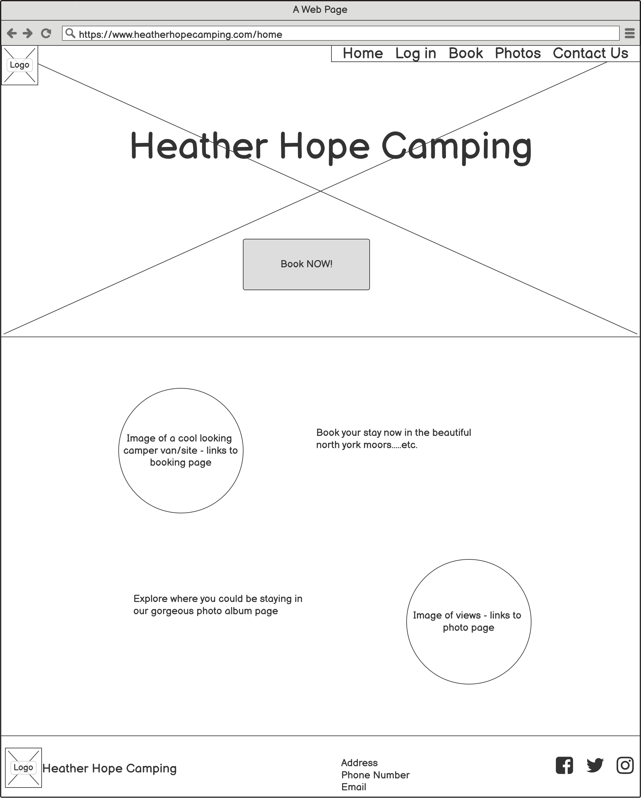
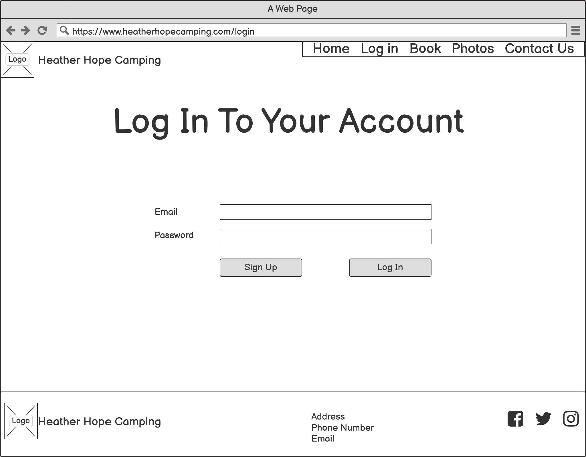
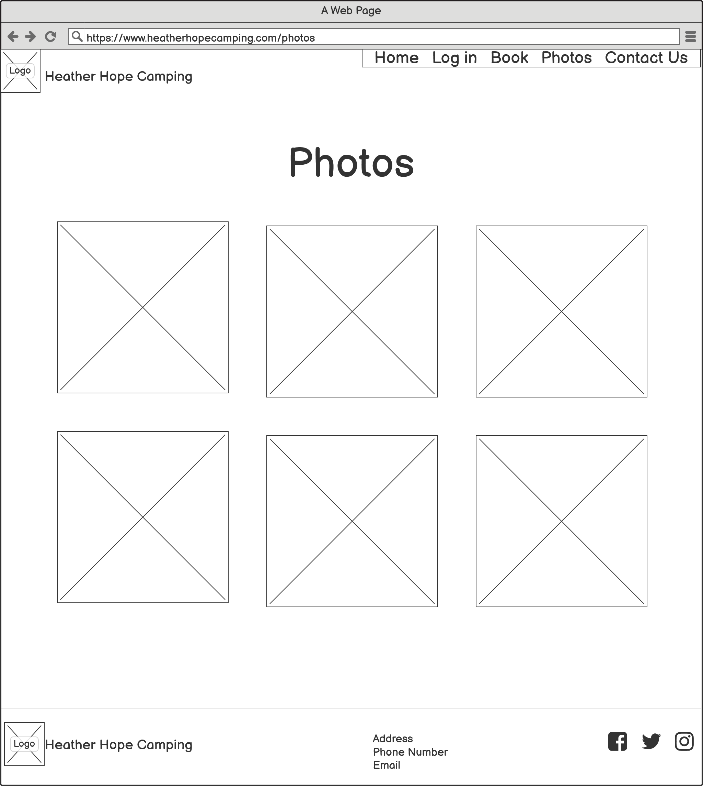
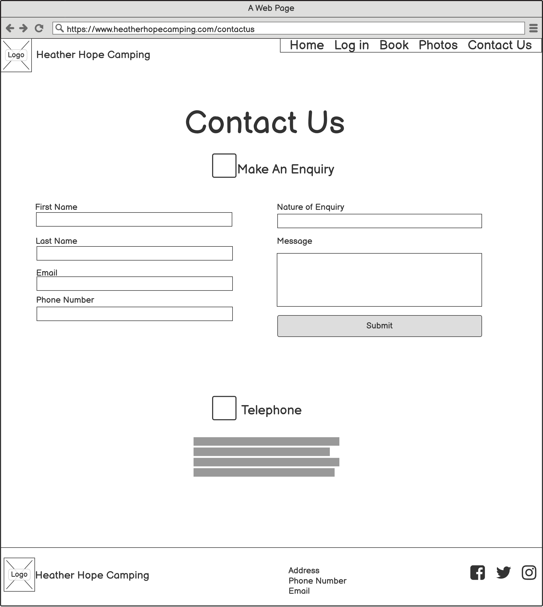

# A Restaurant Booking - The Moore Hen
Portfolio Project 4 Full Stack Toolkit - Code Institute
Find the app [here](https://heatherhope-camp.herokuapp.com/)

# About
The Heather Hope Campsite is a fictional campsite set in the vast expanse of the North York Moors, a place to go for respite from a busy life and adventure. Ever popular, the campsite requires an app with integrated booking service to manage bookings and avoid disappointment for customers.

# User Experience
The app will largely be managed by the campsite staff and thus has two main user perspectives: customers and the business.

## User Stories
This project has been tracked using [GitHub Projects](https://github.com/users/mmoore483/projects/2) which contains all the current user stories.

## Structure
Whilst the focus of this project is on the booking capability, the wireframes consider other elements of the user and business experience that may be implemented in the future.

### WireFrames

<strong>Home Page</strong>

The home page will be responsive with the top menu dropping into a hamburger icon on smaller screen sizes as well as a sticky nav bar to ensure the user can always get to the booking page within a single click. To achieve this, the [scrolling nav](https://startbootstrap.com/template/scrolling-nav) BootStrap theme will be used.

<strong>Log In/Sign Up</strong>

The user requires capability to sign up/log in so that they can make an account and manage their own bookings. Using an email address rather than a username should make it easier for users to remember their details for a site account that is likely to be rarely used. Additionally, the business can keep customer details on file in case of emergencies or last minute cancellations. The majority of the sign up and log in functionality will be achieved using the Django admin site and account templates with the same BootStrap theme as other pages.

<strong>Book</strong>

The booking page will be kept simple with the desire pitch type and dates (preferably with a date picker as this is a better visual for the user but can also restrict data entry). One the submission button has been pressed, the database will be queried and availability displayed back to the user.

<strong>Photos</strong>

The photo page is for the business to entice customers with beautiful images of the campsite. The page layout is simple three column on large screens and one column on small screens. This is a nice-to-have feature that won't be a priority.

<strong>Contact Us</strong>

The Contact Us Page is another form page that allows the user to make enquiries to the business easily. This is a simple form that will automate an email sent to the business and a copy of the email sent to the customer. 

### Database Planning

There needs to be a user table that will be used for account management and for the business to be able to contact customers. This table will contain all details about the customer from email, to name, to phone number etc. The only compulsory fields will be the auto-generated customer_id and the email address as this allows for a unique customer.

There needs to be an area to set business variables such as the different camping pitch types and the quantity of each. This is required to check there is availability. These will only be seen in the admin panel and can only be changed by "superusers" or administrators of the site. Therefore the table is not directly linked but will be queried to ensure that there is availability.

The final table is for the bookings themselves, this will tie in the customer_id where one customer can have multiple bookings however each booking can only have one customer. Therefore this is a one (customer_id) to many (Booking) relationship. The Booking table will also have a unique ID, this will also allow users to query the status of their booking in communication with the business. The booking also requires the pitch type and the dates at which the booking is expected to take place. The status will be pending if available, confirmed if accepted by the business administrators and cancelled if rejected or the user chooses to cancel their booking. Finally, the created_on field can be used to sort bookings so that the business administrators can accept bookings on a first-come-first-serve basis. 

### Comment on Logic

1) The customer will fill in the booking form and press submit
2) The app will read in submitted information and filter the booking table by dates and pitch type
3) Using the customer requested pitch type, the Business Variables table will be queried for the quantity of that pitch type available
4) The number of results from step 2 will be compared to step 3 and if less, then the form will be saved to the database and the status will be set to pending. A notification should be displayed to the user that their booking is pending business confirmation. If the value is higher, then the customer will be told that the dates requested are unavailable and give them the option to try again.
5) The business user can then change the status and this will send a notification the customer account of the outcome. 

## Surface

The BootStrap Theme [scrolling nav](https://startbootstrap.com/template/scrolling-nav) has been used and unadapted at this time - a future iteration is planned to use a heather filled hero-image with shades of purple used to accent the theme. 

## Features

### Existing Features

- Generic Home Page
- Sign Up
- Log In
- Create a booking (without confirmation)

### Features Left to Implement
- Confirmation of booking request
- Notification of booking status
- Option for customer to cancel booking
- Personalised Home Page
- A Photo Page
- A Contact Form that automates sending an email to business
- Restrict booking date selection based on database query
- A date picker for the booking dates selection in Booking page
- Automated Testing

## Testing

### Automated Testing
- 

### Manual Testing
- 

### Validator Testing
- HTML [W3C Validator](https://validator.w3.org/)

- CSS [jigsaw validator](https://jigsaw.w3.org/css-validator/)

- JS [JShint](https://jshint.com/)

- Python [PEP8 online validator](http://pep8online.com/)

### Unfixed Bugs

- 

# Deployment

### Create Application and Postgres DB on Heroku
- Log in to Heroku at https://heroku.com - create an account if needed.
- From the Heroku dashboard, click the Create new app button.  For a new account an icon will be visible on screen to allow you to Create an app, otherwise a link to this function is located under the New dropdown menu at the top right of the screen.
- On the Create New App page, enter a unique name for the application and select region.  Then click Create app.
- On the Application Configuration page for the new app, click on the Resources tab.
- In the Add-ons search bar enter "Postgres" and select "Heroku Postgres" from the list - click the "Submit Order Form" button on the pop-up dialog.
- Next, click on Settings on the Application Configuration page and click on the "Reveal Config Vars" button - check the DATABASE_URL has been automatically set up. 
- Add a new Config Var called DISABLE_COLLECTSTATIC and assign it a value of 1.
- Add a new Config Var called SECRET_KEY and assign it a value - any random string of letters, digits and symbols.
- The settings.py file should be updated to use the DATABASE_URL and SECRET_KEY environment variable values as follows :

  - DATABASES = {'default': dj_database_url.parse(os.environ.get('DATABASE_URL'))}

  - SECRET_KEY = os.environ.get('SECRET_KEY')

- In Gitpod, in the project terminal window, to initialize the data model in the postgres database, run the command python3 manage.py migrate 
- Make sure the project requirements.txt file is up to date with all necessary supporting files by entering the command pip3 freeze --local > requirements.txt
- Commit and push any local changes to GitHub.
- In order to be able to run the application on localhost, add SECRET_KEY and DATABASE_URL and their values to env.py

### Connect the Heroku app to the GitHub repository
- Go to the Application Configuration page for the application on Heroku and click on the Deploy tab.
- Select GitHub as the Deployment Method and if prompted, confirm that you want to connect to GitHub. Enter the name of the github repository (the one used for this project is (https://github.com/mmoore483/camping) and click on Connect to link up the Heroku app to the GitHub repository code.
- Scroll down the page and choose to either Automatically Deploy each time changes are pushed to GitHub, or Manually deploy - for this project Manual Deploy was selected.
- The application can be run from the Application Configuration page by clicking on the Open App button.
- The live link for this project is (https://heatherhope-camp.herokuapp.com/)

### Final Deployment steps
Once code changes have been completed and tested on localhost, the application can be prepared for Heroku deployment as follows:
- Set DEBUG flag to False in settings.py
- Ensure requirements.txt is up to date using the command pip3 freeze --local > requirements.txt
- Push files to GitHub
- In the Heroku Config Vars for the application delete this environment variable DISABLE_COLLECTSTATIC
- On the Heroku dashboard go to the Deploy tab for the application and click on deploy branch

## Forking

To trial changes to the site without affecting the original, the GitHub Repository can be forked.

- Log into GitHub and locate the desired repository
- In the top right, click the Fork button.

## Cloning

[Cloning](https://docs.github.com/en/github/creating-cloning-and-archiving-repositories/cloning-a-repository-from-github/cloning-a-repository) is useful for a multitude of reasons: to contribute to a project, to trial changes, to fix merge conflicts, add or remove files, and push larger commits.

- Log into your GitHub then find the gitpod repository
- Click the Code button
- If cloning with HTTPS, click the clipboard icon to copy the link
- Open Gitbash
- Change the current working directory to the location where you want the cloned directory to be.
- Type git clone, and then paste the URL you copied earlier.
- Press enter to create your local clone

# Credits

- Code Institute for the template and course content
- [BootStrap Theme](https://startbootstrap.com/template/scrolling-nav)
- The Very Academy YouTube for [videos](https://www.youtube.com/watch?v=Ae7nc1EGv-A&ab_channel=VeryAcademy) on creating administration panels
- LucidCharts for diagramming including the above database diagram
- Mentor: Brian Machari
- Tutor Support: James 
